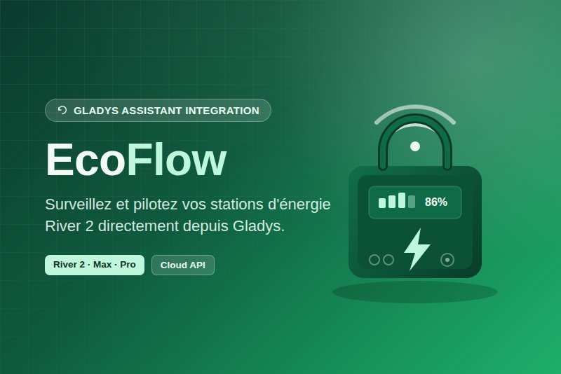

# gladys-ecoflow



External integration for [Gladys Assistant](https://gladysassistant.com) to monitor and control
EcoFlow portable power stations (River 2 family: River 2, River 2 Max, River 2 Pro), via two
independent onboarding methods (either one alone is enough — see `src/config.js`'s header):

1. **Official Open Platform API** (recommended) — a free developer Access Key/Secret Key, signed
   REST requests, auto-discovers every device on the account.
2. **Simple login** (unofficial, optional) — the same email/password the EcoFlow app itself uses,
   MQTT-based, no developer account or approval wait, but no device auto-discovery (the serial
   number is typed in by hand).

Requires **Gladys Assistant 5.1+** (the integration declares a dashboard widget and scene
triggers/actions, which older cores reject). Built on the JavaScript SDK
[`@gladysassistant/integration-sdk`](https://github.com/GladysAssistant/integration-sdk-js), from
the official [`integration-template-js`](https://github.com/GladysAssistant/integration-template-js).

**No LAN-only control path exists for these devices, either way.** Unlike a Tuya/Zigbee device,
EcoFlow devices have no local server of their own — control and telemetry always go through
EcoFlow's cloud, even for a device that only ever sits on your own WiFi (confirmed against
EcoFlow's own support stance: the only exception across EcoFlow's whole catalog is the unrelated
EZ1). This integration is therefore cloud-only by necessity, not by choice — see `docs/en.md` for
the full reasoning and `gladys-assistant-integration.json`'s `transports: ["cloud"]`.

## What it does

- **Two transports behind one shared interface**: `{ getQuota(sn), sendCommand(sn, moduleType,
operateType, params) }`, implemented by `createPublicTransport()` (`src/ecoflow/client.js`, a
  signed REST request) and `createPrivateTransport()` (`src/ecoflow/privateClient.js`, an MQTT
  publish/subscribe round-trip with a single shared session). `src/devices/device.js` never
  branches on which one backs a given device — the registry carries the right transport alongside
  each device's `sn`, and is rebuilt on every configuration change.
- **Polling, deduplicated**: a background timer (`poll_interval_seconds`, default 30s) re-fetches
  each device's quota snapshot; polls never overlap, and only the values that changed are sent to
  Gladys, in batches (`publishStates`) — the host API allows 300 states per minute.
- **Commands reflected at once**: an accepted command publishes the new value immediately, then the
  device is re-read 3 s later to confirm. A command that must echo other current settings
  (`acOutCfg`, `watthConfig`) re-reads the unit first and is never sent with a made-up default.
- **Features** (`src/ecoflow/quota.js`, shared by both transports): battery level, AC charging
  power, total output power, AC output power, solar input power, discharge remaining time,
  charging (read-only), and AC output / X-Boost / DC output / backup reserve (switches).
- **Gladys 5.1 surfaces**: a dashboard widget (`src/widget.js`), six scene triggers — wall power
  lost/restored, station offline/online, charge limit reached, battery low (`src/devices/events.js`) — and five
  scene actions for the numeric settings that have no feature type: charge/discharge limit, backup
  reserve, AC charging power/pause, and an on-demand read (`src/sceneActions.js`).
- **Honest status**: per-device transport badges (`cloud`, `cloud` + degraded, `unreachable`) and a
  connection status that reports each method separately after actually trying it.
- **Command shapes shared across both transports** (`src/ecoflow/commands.js`), each validated
  against `@ecoflow-api/schemas`' real zod schemas before being sent.

## New to this codebase? Start here

An "external integration" is a small Node.js program Gladys runs as its own Docker container,
talking to the Gladys hub over one WebSocket (handled by the SDK). Recommended reading order:

1. [`src/ecoflow/signing.js`](./src/ecoflow/signing.js) — no I/O: the HMAC-SHA256 request signing
   for Method 1, cross-confirmed against two independent reference implementations.
2. [`src/ecoflow/client.js`](./src/ecoflow/client.js) — Method 1's REST transport.
3. [`src/ecoflow/privateClient.js`](./src/ecoflow/privateClient.js) — Method 2's transport: login,
   the MQTT session rules, the `latestQuotas` request/reply round-trip.
4. [`src/ecoflow/commands.js`](./src/ecoflow/commands.js) — command builders, schema-validated.
5. [`src/ecoflow/quota.js`](./src/ecoflow/quota.js) — PURE: quota <-> Gladys features, and the
   `summarizeQuota()` view used by the widget, triggers and scene actions.
6. [`src/devices/device.js`](./src/devices/device.js) — the registry, deduplicated state
   publishing, transport badges, `onSetValue` and the manifest actions.
7. [`src/devices/index.js`](./src/devices/index.js) — device lists, routing (`transportForSn()`),
   the poll loop.
8. [`src/devices/events.js`](./src/devices/events.js) — PURE: scene trigger detection.
9. [`src/widget.js`](./src/widget.js) / [`src/sceneActions.js`](./src/sceneActions.js) — the Gladys
   5.1 widget content and scene action handlers.
10. [`src/app.js`](./src/app.js) — the orchestration: configuration lifecycle, connection status,
    poll scheduling, event wiring. [`index.js`](./index.js) only bootstraps the SDK.

## Dependencies

| Package                                                                                              | Role                                                                                           |
| ---------------------------------------------------------------------------------------------------- | ---------------------------------------------------------------------------------------------- |
| [`@gladysassistant/integration-sdk`](https://www.npmjs.com/package/@gladysassistant/integration-sdk) | Talking to the Gladys hub: auth, the WebSocket connection/reconnection, the event/method API.  |
| [`@ecoflow-api/schemas`](https://www.npmjs.com/package/@ecoflow-api/schemas)                         | Real, current zod schemas for the EcoFlow Open Platform's request/response and command shapes. |
| [`mqtt`](https://www.npmjs.com/package/mqtt)                                                         | MQTT.js — the standard Node MQTT client, used only by Method 2's transport (privateClient.js). |

Everything else — the REST client, HMAC-SHA256 request signing, the private-login MQTT
request/reply orchestration, config normalization — is hand-written on top of Node built-ins
(`node:crypto`, the global `fetch`), the same reasoning gladys-lubluelu-vaccum's own Tuya Cloud
client used ("small and specific enough... pulling in a full SDK wasn't worth it"), here amplified
by necessity for Method 1:

> **`@ecoflow-api/rest-client@0.6.0` is broken.** Its published bundle contains a stray
> `require("@ecoflow-api/schemas/src/river2Pro/setCommands/bms")` — a deep source-path import that
> can never resolve against the published, `dist`-only `@ecoflow-api/schemas` package. This throws
> at module load, unconditionally, for every consumer — confirmed by this repo's own test suite
> failing on nothing more than `import { RestClient } from '@ecoflow-api/rest-client'`. So this
> integration depends on `@ecoflow-api/schemas` directly (unaffected: pure zod, no such import) and
> re-implements the small REST/signing layer itself (`src/ecoflow/signing.js`,
> `src/ecoflow/client.js`), cross-checked against `@ecoflow-api/rest-client`'s own _source_ (read,
> not executed) and against `tolwi/hassio-ecoflow-cloud`'s `api/public_api.py`. The internal
> `createEcoflowClient()` helper it wraps returns the exact same 3-method shape
> (`getDevicesPlain`/`getDevicePropertiesPlain`/`setCommandPlain`) `RestClient` exposes, so a future
> fixed release could be swapped back in without touching any other file.

Also worth noting: every one of `@ecoflow-api/schemas`' River 2 command schemas gates its top-level
`sn` field on `river2ProSerialNumberSchema` (`R621...`-only) — a Pro-specific guard with nothing to
do with the actual wire format. `src/ecoflow/commands.js#sendCommand` validates only
`schema.shape.params` for exactly this reason; see that function's own comment.

Method 2's transport (`src/ecoflow/privateClient.js`) is cross-checked the same way, against
`tolwi/hassio-ecoflow-cloud`'s `api/private_api.py` and `devices/__init__.py` — see that file's
header for the exact endpoints/topics confirmed and the trade-offs this method carries.

Dev-only dependencies (never shipped in the Docker image): `eslint` + `@eslint/js` +
`eslint-config-prettier` + `globals` for linting, `prettier` for formatting. Testing uses no
library: `npm test` runs Node's own `node --test`.

## Keeping dependencies current (CI/CD)

Three independent [Dependabot](https://docs.github.com/en/code-security/dependabot) watchers
(`.github/dependabot.yml`): `npm` (this repo's packages), `docker` (the Dockerfile base image), and
`github-actions` (the workflows' own actions). Every PR Dependabot opens runs the full `ci.yml`
suite (lint, `node --test`, a real `docker build`).

**Auto-merge, low-risk patch bumps only** (`.github/workflows/dependabot-auto-merge.yml`): the
Dockerfile base image, the GitHub Actions, and npm **dev** dependencies auto-merge once CI is
green, for a PATCH-level bump only. Deliberately **never** auto-merged, at any semver level:
`@ecoflow-api/schemas`, `@gladysassistant/integration-sdk`, and `mqtt` — the first two are pre-1.0,
and this repo's own tests mock the EcoFlow client/MQTT broker entirely, so they cannot catch a real
behavior change in any of these packages the way a real-SDK smoke-import job could. A bad silent
bump here would mean sending a wrong command to a real power station — left for a human to review,
every time.

**Automatic releases** (`.github/workflows/auto-release.yml`): the moment a Dependabot PR that
changes the shipped image merges (base image, runtime or transitive npm dependency), a patch release
is cut and its multi-arch image published automatically. Dev-dependency and GitHub Actions updates
cut no release: they change nothing for users.

**Base image**: `node:24-alpine` (the LTS line the Gladys core runs on), pinned by digest — security
rebuilds arrive as Dependabot digest PRs; Node majors are bumped by hand.

**CI** (`.github/workflows/ci.yml`): Prettier, ESLint and the tests with coverage thresholds on
Node 22 and 24, `npm audit` of the runtime dependencies, the official Gladys store validator, and a
Docker build for amd64 and arm64. `.github/workflows/release.yml`
is still there for a deliberate minor/major release, run by hand from the Actions tab.

## Project structure

```
.
├─ index.js                    # bootstraps the SDK client, nothing else
├─ src/
│  ├─ app.js                   # orchestration: config lifecycle, status, polling, event wiring
│  ├─ widget.js                # PURE: the dashboard widget content (Gladys 5.1)
│  ├─ sceneActions.js          # scene action handlers (Gladys 5.1)
│  ├─ ecoflow/
│  │  ├─ signing.js            # PURE: HMAC-SHA256 request signing (Method 1)
│  │  ├─ client.js             # Method 1: official REST transport
│  │  ├─ privateClient.js      # Method 2: simple login + MQTT transport (unofficial)
│  │  ├─ commands.js           # command builders, shared by both transports
│  │  └─ quota.js              # PURE: EcoFlow quota <-> Gladys features + quota summary
│  ├─ devices/
│  │  ├─ device.js             # registry, state publishing, transport badges, actions
│  │  ├─ events.js             # PURE: scene trigger detection
│  │  └─ index.js              # device lists, routing, the poll loop
│  └─ config.js                # config defaults + normalization for both methods
├─ test/                       # node --test, no library; app.test.js drives src/app.js
├─ test-fixtures/              # fake SDK client and fake transport
├─ docs/
│  └─ en.md / fr.md            # END-USER documentation, re-hosted by Gladys itself in its UI
├─ gladys-assistant-integration.json  # the manifest: config form, actions, widget, scenes
├─ Dockerfile                  # single stage, node:24-alpine pinned by digest
└─ cover.jpg                   # catalog cover (JPEG: Gladys caps this at 150 KB)
```

## Run it locally

```bash
npm install
GLADYS_HOST_API_URL="http://localhost:1443" \
GLADYS_INTEGRATION_TOKEN="<token>" \
GLADYS_INTEGRATION_SELECTOR="ecoflow" \
LOG_LEVEL=debug \
npm start
```

## Quality checks

```bash
npm run format:check   # Prettier
npm run format          # Prettier, write
npm run lint             # ESLint
npm test                 # node --test
npm run test:coverage    # node --test + coverage thresholds (as in CI)
```

`test/signing.test.js` is a genuine round-trip check: every expected signature is computed
independently with Node's own `crypto.createHmac` against a hand-built message string, not by
calling `computeSignature()` a second time. `test/client.test.js` exercises the real
`createPublicTransport()` against a fake `fetchImpl` (URL, headers, signed request bodies — not a
mock of the transport itself). `test/privateClient.test.js` does the same for Method 2's login/MQTT
credential fetch, plus the request/reply correlation logic against a fake MQTT client. `test/commands.test.js`
additionally re-validates every sent command's `params` against `@ecoflow-api/schemas`' own,
current zod schemas — real schema drift fails here, not just a stale copy of it.

## Validate before publishing

```bash
npx github:GladysAssistant/integration-store .
```

## Publish

Add the GitHub topic `gladys-assistant-integration`, then **Actions → Release → Run workflow**
(bumps `package.json` + the manifest, tags, builds the multi-arch image) for a deliberate
minor/major release — patch releases from dependency updates ship on their own, see
"Keeping dependencies current" above. See the
[integration-template-js README](https://github.com/GladysAssistant/integration-template-js) for
the full publishing flow.

## Scope

Discovery (both methods), seven sensors, four switches, a dashboard widget, six scene triggers and
five scene actions — built once for the whole River 2 family, shared by both onboarding methods.
Not done yet: real-time MQTT push for Method 1, other EcoFlow models, and moving the AC input power
to Gladys' "grid" energy category — see `docs/en.md`'s "Possible follow-ups".

## Tested and confirmed

See `docs/en.md`'s "Tested and confirmed" section for the full breakdown — in short: Method 2 was
tested by the maintainer on a real River 2 Pro; both transports' wire formats are cross-confirmed
against independent, live-used reference implementations; this repo's own test suite (160+ tests,
no network, no real EcoFlow account, no real MQTT broker) covers the orchestration too. Not yet
confirmed on a real unit: the scene actions, the wall-power detection from `inv.acInVol` and the
remaining-time field. Run the **Diagnostics** action and open an issue for anything that looks off.

## License

Apache-2.0
